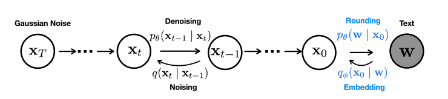
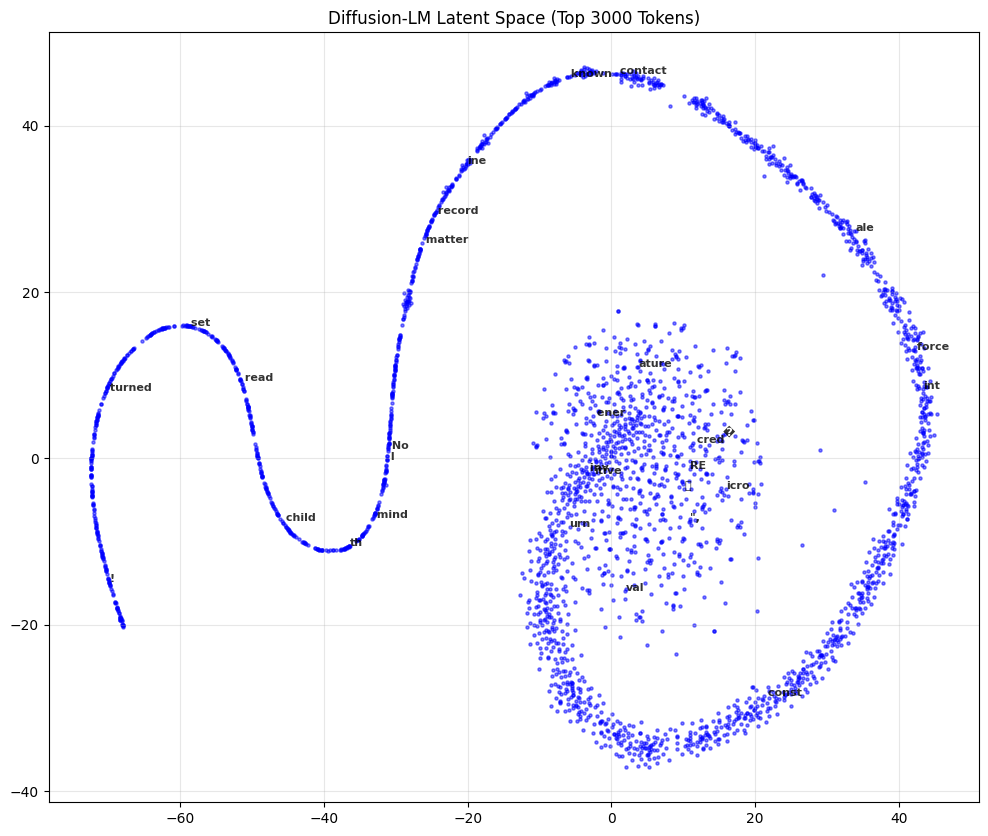
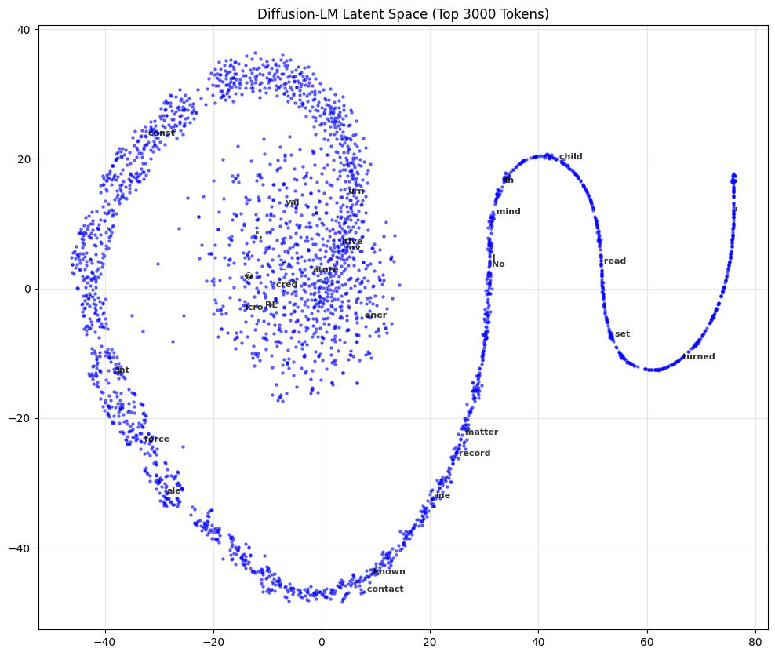
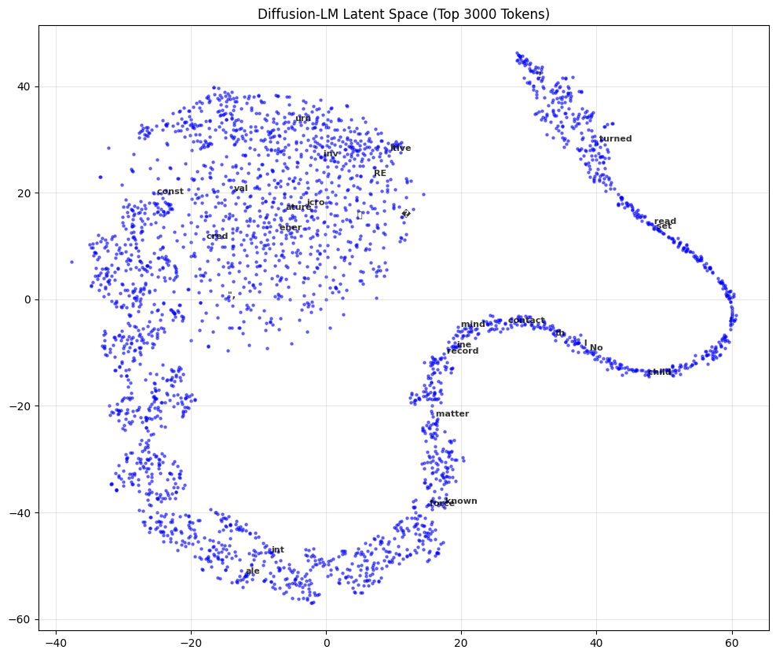
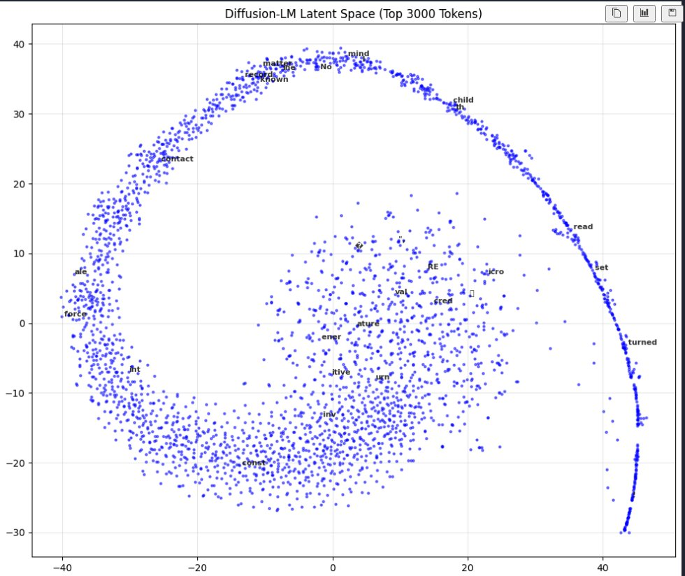
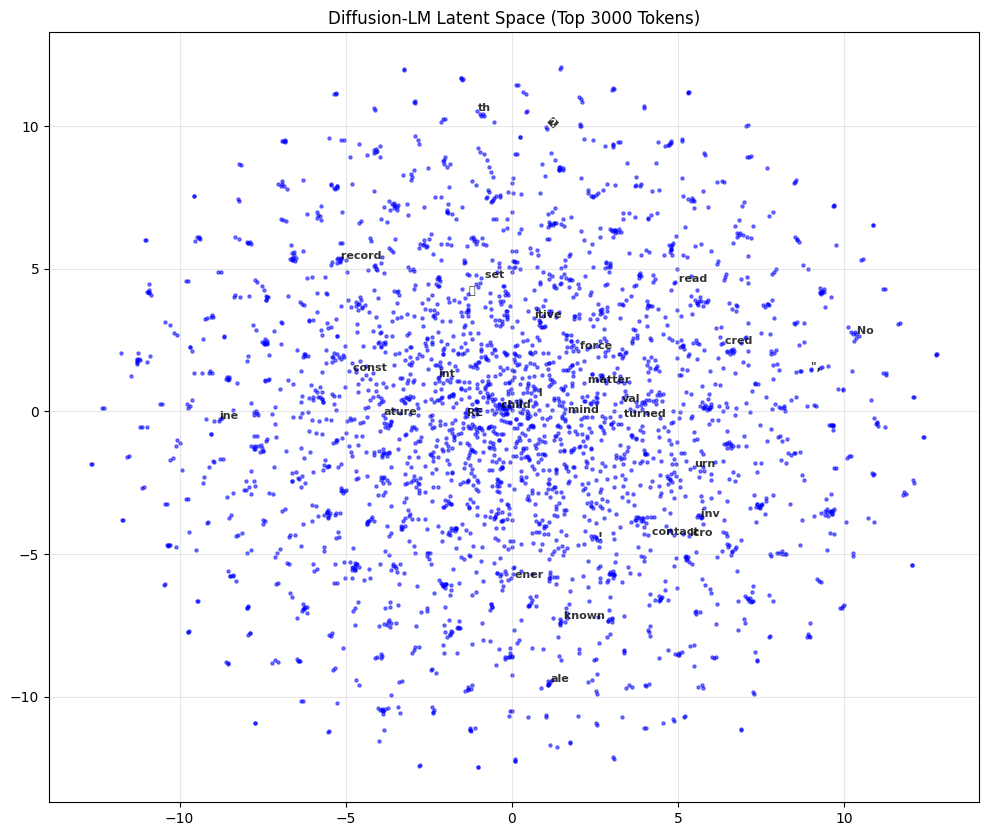
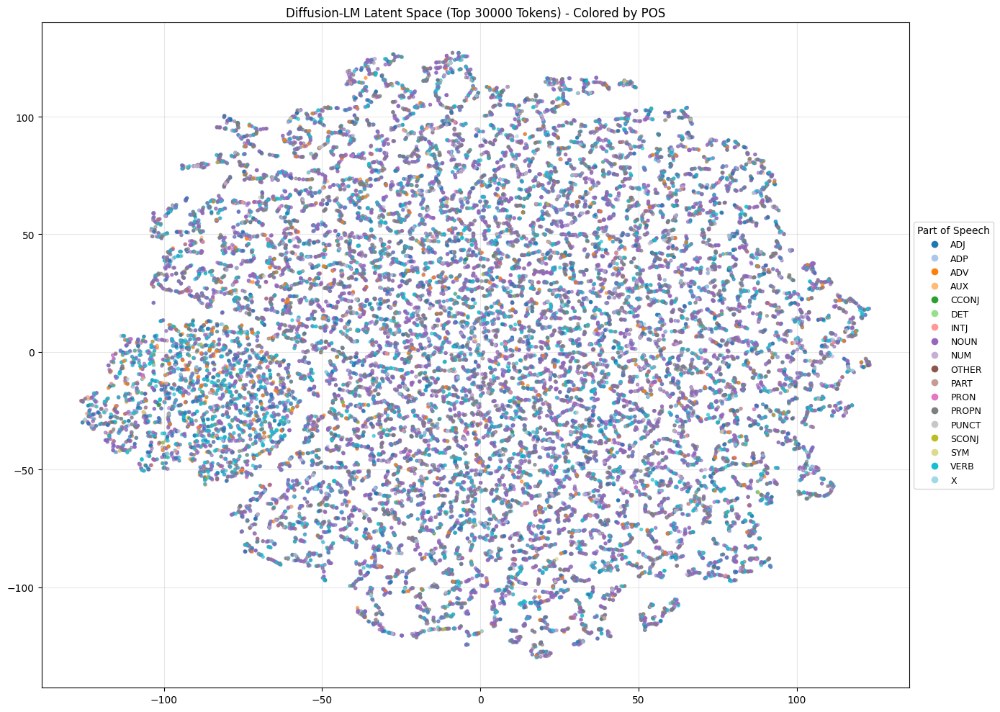

# Diffusion-LM
This repository contains my work and experimentation in implementing a Diffusion-based (Small) Language Model (Diffusion-LM) from scratch. 

## Tasks Achieved:
- Implemented GPT2 following Karpathy's Tutorial
- Implemented a very basic version of [Diffusion-LM](https://arxiv.org/abs/2205.14217)
- Added 2D embedding space visuals using t-SNE along with POS based color-coding. 
- Improved Diffusion Training by fixing training data.
- Training on E2E dataset and ROCStories.

### Some Weird t-SNE Plots of Embedding Space
<table>
  <tr>
    <td></td>
    <td></td>
    <td></td>
  </tr>
  <tr>
    <td></td>
    <td></td>
  </tr>
</table>

### Plot of E2E training after 20k epochs with T=1000

<!-- 

  
  
<i>E2E dataset inference after training for 50k epochs with 1k time steps</i>

 -->

## TO-DOs:
- Explore Anchoring and Discrete Diffusion methods
- Benchmark with GPT2 on the E2E and ROCStories Dataset.
- Benchmark using HF Diffusion SLMs on the same datasets.
- Try to beat/match SOTA!
